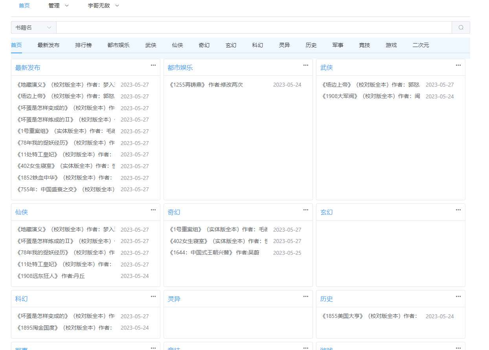
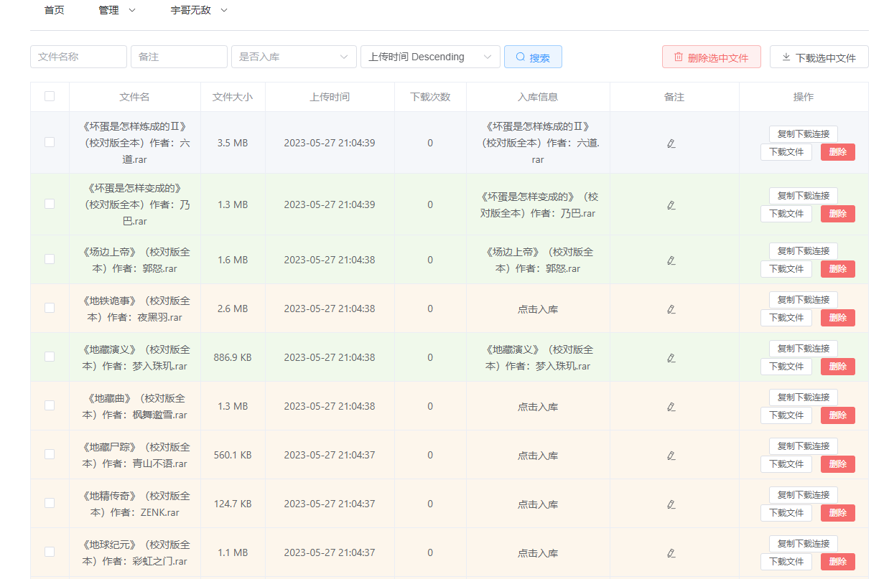
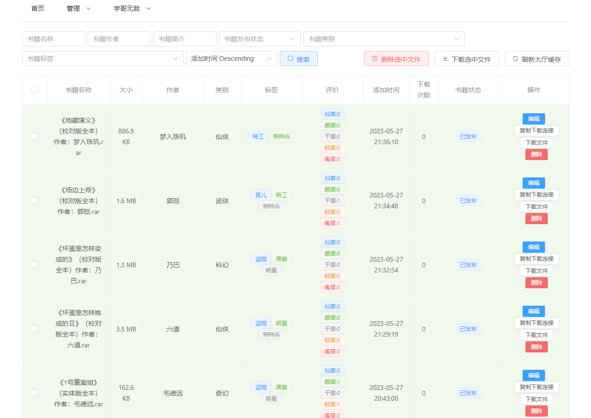
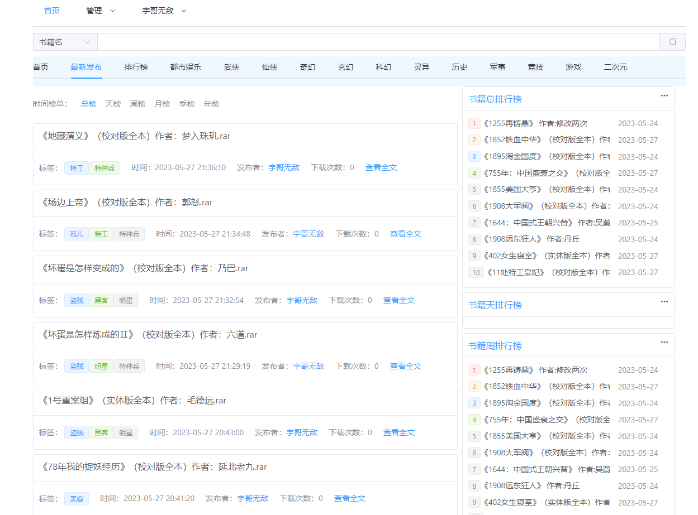
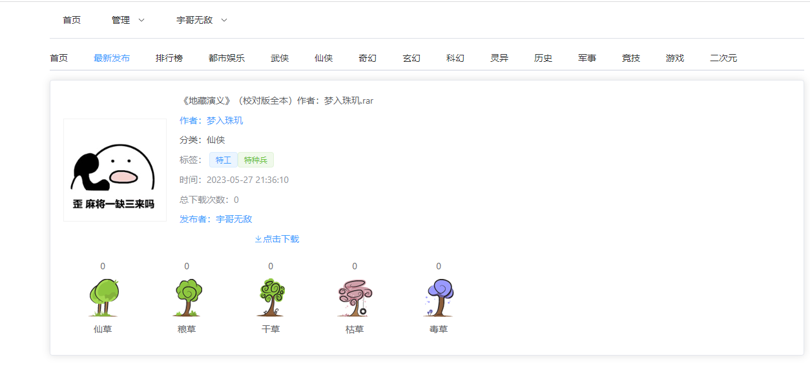

# xbook
###### 基于阿里云盘的 知轩藏书站


部署环境系统使用centos8stream
### 1.docker 部署 [建议]

##### 从git上面下载源码
```
cd /data/
git clone https://github.com/nineaiyu/xbook
```

#### docker环境安装 [centos8]
```
cd /data/xbook/docker/init
sh init.sh
```
#### 域名准备
- 域名： xbook.hehelucky.cn
- 证书（nginx）[可选，参考文档末尾说明]

#### 配置域名和证书
```shell script
nginx.conf.d/xbook.conf
```


##### client配置文件 .env
```javascript
VITE_API_DOMAIN=''
```

#####  构建静态资源和api服务
```
cd /data/xbook/docker/scripts
sh build.sh
```
##### 构建镜像的同时，下载依赖镜像
```shell
docker pull 'bitnami/mariadb:10.7.3'
docker pull 'bitnami/redis:6.2.7'
docker pull 'nginx:1.21.3'
```

#####  启动所有服务
```
cd /data/xbook/docker/scripts
sh start_all.sh
```

#####  关闭所有服务
```
cd /data/xbook/docker/scripts
sh stop_all.sh
```

##### 根据提示创建默认管理用户,主要用与添加默认阿里云盘存储，管理上传发布书籍
```shell
docker exec -it xbook python manage.py createsuperuser
```

端口80和443，浏览器输入配置的域名即可访问或者服务器的ip直接访问

### 2.本地部署
#### 构建前端页面
##### 安装构建环境node,需要nodejs 1.16,centos8默认是1.10，需要重置模块，更换1.16版本
```shell
dnf module reset nodejs -y
dnf module enable nodejs:16-epel -y
dnf install nodejs -y
npm install -g yarn
```

##### 开始构建前端web页面
```shell
cd client
yarn install
yarn build
```
构建成功的文件位于```dist```目录下，该目录下为前端页面，拷贝到相应前端目录

#### 部署服务器
##### 安装依赖环境,服务端需要python39环境,并创建python虚拟环境
```shell
dnf install python39 python39-devel mariadb-devel -y
python3.9 -m venv py39
source py39/bin/activate
```

##### 安装依赖,进入server目录
```shell
pip install -U setuptools pip
pip install -r requirements.txt
```

##### 创建数据库,并迁移数据【安装服务可选】
```shell
dnf install mariadb-server -y
```
```mariadb
create database xbook default character set utf8 COLLATE utf8_general_ci;
grant all on xbook.* to xbook@'127.0.0.1' identified by 'KGzKjZpWBp4R4RSa';
```
或者根据现有的mariadb修改相应的配置
```python
DATABASES = {
    'default': {
        'ENGINE': 'django.db.backends.mysql',
        'NAME': 'xbook',
        'USER': 'xbook',
        'PASSWORD': 'KGzKjZpWBp4R4RSa',
        'HOST': 'mariadb',
        'PORT': 3306,
        'CONN_MAX_AGE': 600,
        'OPTIONS': {'init_command': 'SET sql_mode="STRICT_TRANS_TABLES"', 'charset': 'utf8mb4'}
    }
}
```

##### redis配置【安装服务可选】
```shell
dnf install redis -y
```
根据redis修改相应的配置文件
```python
REDIS_PASSWORD = "nineven"
REDIS_HOST = "redis"
REDIS_PORT = 6379
```

##### 迁移数据库，并启动
```shell
python manage.py makemigrations
python manage.py migrate

# -u nginx 指需要启动的用户，需要有nginx用户，或者其他用户也行
python manage.py start all -u nginx 
```


### 域名SSL支持
- 证书可以从阿里云或者腾讯云申请，每次可免费申请一年
- 还可以使用免费的letsencrypt证书

#### 配置SSL证书
```shell
vim docker/nginx/nginx.conf.d/xbook.conf
```
增加下面ssl支持配置
```shell
     listen 443 ssl http2;
     ssl_certificate        /etc/nginx/conf.d/xbook.hehelucky.cn.pem;
     ssl_certificate_key    /etc/nginx/conf.d/xbook.hehelucky.cn.key;
     ssl_protocols TLSv1.1 TLSv1.2 TLSv1.3;
     ssl_ciphers EECDH+CHACHA20:EECDH+CHACHA20-draft:EECDH+AES128:RSA+AES128:EECDH+AES256:RSA+AES256:EECDH+3DES:RSA+3DES:!MD5;
     ssl_prefer_server_ciphers on;
     ssl_session_cache shared:SSL:10m;
     ssl_session_timeout 10m;
     add_header Strict-Transport-Security "max-age=31536000";
```
重新nginx容器
```shell
cd docker/nginx
docker compose down
docker compose up -d
```
****
[Demo访问](https://xbook.heheshow.cn/)

功能预览：




